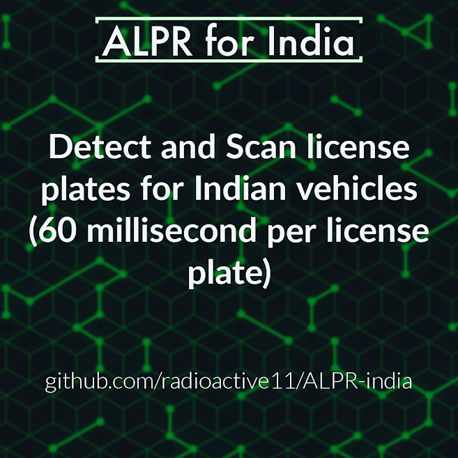

[![Contributors][contributors-shield]][contributors-url] 
[![Forks][forks-shield]][forks-url]
[![Stargazers][stars-shield]][stars-url]
[![Issues][issues-shield]][issues-url]
[![MIT License][license-shield]][license-url]
[![LinkedIn][linkedin-shield]][linkedin-url]


<!-- PROJECT LOGO -->
<br />
<p align="center">
  <a href="https://github.com/radioactive11/ALPR-India">
    
  </a>

  <h2 align="center">Automatic License Plate Recognition</h>

  <h4 align="center">
  <p align="center">
    Detect and scan license plate number from vehicle images
    </h4>
  </p>
</p>


<!-- TABLE OF CONTENTS -->
## Table of Contents

- [Table of Contents](#table-of-contents)
- [About The Project](#about-the-project)
- [Built With](#built-with)
- [Getting Started](#getting-started)
  - [Installation](#installation)
- [Usage](#usage)
- [Product Screenshot](#product-screenshot)
- [Roadmap](#roadmap)
- [Contributing](#contributing)
- [License](#license)
- [Contact](#contact)


<!-- ABOUT THE PROJECT -->
## About The Project


ALPR for India detects license plates from images of vehicles and converts license plate numbers to strings. This can be used by law enforcement vehicles to scan, in real time, **vehicle insuarance expiry**, **pollution check certificate validation**, and **possible blacklisted** vehicles on road </br>

The model was trained using YoloV4 on 2000 car images from [Google Open Image Dataset](https://g.co/dataset/open-images)

I used the [OIDv4 Tool Kit](https://github.com/Francisobiagwu/OIDv4_ToolKit) to fetch the images along with thier labels.


## Built With

* [Python](https://www.python.org/)
* [Darknet](https://pjreddie.com/darknet/)
* [pyTessearct](https://pypi.org/project/pytesseract/)
* [OpenCV](https://opencv.org/)


<!-- GETTING STARTED -->
## Getting Started

This application is targetted for windows and will work on other operating systems with some slight modifications. 
You will need:

- Python (>=3.6)
- OpenCV(>=4.0)
- pyTesseract (installed in *"C:\Program Files\Tesseract-OCR\tesseract.exe"*)

To get a local copy up and running follow these simple example steps.


### Installation

1. Make sure you have python3 setup on your system
2. Clone the repo
```sh
git clone https://github.com/radioactive11/ALPR-India
```
3. Install requirements
```sh
pip install -r requirements.txt
```
4. Save test images to *```data/plates/```*

5. Open terminal and enter
```
python3 plates.py
```
6. Cropped images will be saved in *```cropped/```*
7.  Open terminal and enter
```
python3 ocr.py
```
8. Press any key to move on to the next image


<!-- USAGE EXAMPLES -->
## Usage

This application can be used to

- search for stolen cars
- check if vehicle on road has insuarance
- check if vehicle has active & valid pollution certificate
- check if vehicle is blacklisted
- retrieve owner name & contact information in case of accident
  
  All these features are possible if we search the License Plate Number in the database on [vahaan.nic.in](https://vahan.nic.in/nrservices/faces/user/searchstatus.xhtml)

## Product Screenshot
<p> Part 1: Cropping license plates from the entire image </p>

![product-screenshot1]

<p> Part 2: Using OCR to read the cropped license plates </p>

![product-screenshot2]


<!-- ROADMAP -->
## Roadmap

See the [open issues](https://github.com/radioactive11/ALPR-India/issues) for a list of proposed features (and known issues).


<!-- CONTRIBUTING -->
## Contributing

Contributions are what make the open source community such an amazing place to be learn, inspire, and create. Any contributions you make are **greatly appreciated**.

1. Fork the Project
2. Create your Feature Branch (`git checkout -b feature/AmazingFeature`)
3. Commit your Changes (`git commit -m 'Add some AmazingFeature'`)
4. Push to the Branch (`git push origin feature/AmazingFeature`)
5. Open a Pull Request


<!-- LICENSE -->
## License

Distributed under the MIT License. See `LICENSE` for more information.


<!-- CONTACT -->
## Contact

Arijit Roy - [@this_is_radioactive11](https://www.instagram.com/this_is_radioactive11/) <br />
Project Link: [https://github.com/radioactive11/ALPR-India](https://github.com/radioactive11/ALPR-India)


<p align="center"> Made with :blue_heart: for India

[contributors-shield]: https://img.shields.io/github/contributors/radioactive11/ALPR-India.svg?style=flat-square
[contributors-url]: https://github.com/radioactive11/ALPR-India/graphs/contributors
[forks-shield]: https://img.shields.io/github/forks/radioactive11/ALPR-India.svg?style=flat-square
[forks-url]: https://github.com/radioactive11/ALPR-India/network/members
[stars-shield]: https://img.shields.io/github/stars/radioactive11/ALPR-India.svg?style=flat-square
[stars-url]: https://github.com/radioactive11/ALPR-India/stargazers
[issues-shield]: https://img.shields.io/github/issues/radioactive11/ALPR-India.svg?style=flat-square
[issues-url]: https://github.com/radioactive11/ALPR-India/issues
[license-shield]: https://img.shields.io/github/license/radioactive11/ALPR-India.svg?style=flat-square
[license-url]: https://github.com/radioactive11/ALPR-India/blob/master/LICENSE.txt
[linkedin-shield]: https://img.shields.io/badge/-LinkedIn-black.svg?style=flat-square&logo=linkedin&colorB=555
[linkedin-url]: https://linkedin.com/in/arijit--roy
[product-screenshot1]: readme_files/part1.gif
[product-screenshot2]: readme_files/part2.gif
[product-post]: images/post.png
